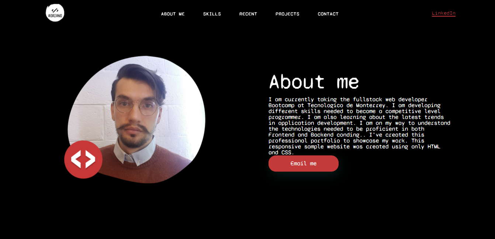
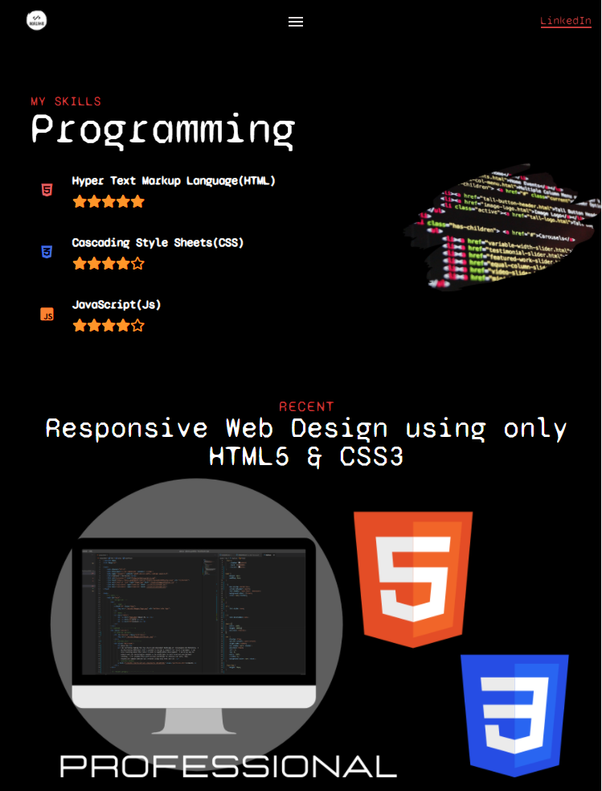
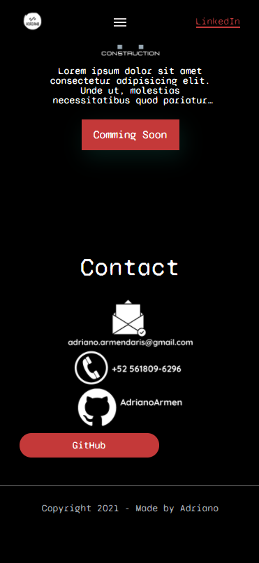

# adrianos-portfolio

Homework 2 - Professional Portfolio

HTML Coding / CSS Styling / Responsive Web Design

## HOMEWORK LINKS

* GitHub Repository [GitHub repository link](https://github.com/AdrianoArmen/adrianos-portfolio-2) 

* Website Deployed [Website Deploy link](https://adrianoarmen.github.io/adrianos-portfolio-2/) 

## Description

This sample website was designed to showcase my advanced CSS skills along with structural knowledge on how to set up a single-page application. This project also references my problem-solving skills using online resources to investigate and deploy real-time design ideas into my website. By using only HTML5 and CSS3 I have created a simple professional portfolio in which I will display all my upcoming projects. I procured a bold style different from the mockup to enhance its unique appearance. I was able to investigate a number of styling techniques to make the navigation bar adapt to the viewer screen size. I used media queries to make this project a responsive web design example.

## Screenshots

* Desktop Screen View:

* Tablet Screen View:

* Mobile Screen View:

## License 📄

This project is licensed under the MIT License - see the [LICENSE.md](LICENSE.md) file for details

---

© 2021 Adriano.
